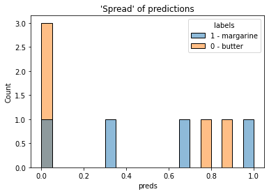

*Note - The results are, somewhat intentionally for the sake of the pun, terrible. However, I do hope the code may provide a half-decent starting point for others looking to churn out predictions with a CNN in python!*

---

# AI can't believe it's not butter

In 1981 a new margarine spread, and arguably one of the world's most significant innovations, was first unveiled - "I Can't Believe It's Not Butter!"

In the years since its release, humans have tried desperately to identify true butter from a growing army of imposters, with limited success. But why struggle alone?

On the back of recent advances in AI such as AlphaFold and ChatGPT, I'm excited to introduce a basic CNN that is rubbish at separating images of butter from margarine. 

If you're keen to understand why it's so bad (and maybe learn a little about training a CNN with pytorch) please do check out the rest of the repo!

<p align="center">

</p>

---

## Repo structure

```
data                    # dAIry data

src
-- scrape.py            # scrape Google for images using bs4
-- data_preparation.py  # add images to pytorch DataLoader
-- CNN.py               # define pytorch CNN architecture
-- train.py             # train, validate, and evaluate
-- plot.py              # plot loss, predictions, and images
-- example.ipynb        # end-to-end example
```

---

## Why won't it believe?

Lots of reasons!

* I train on incredibly little data.
    * By default, Google only allows you to scrape the first 20 images from a search query - try using Selenium or other similar libraries for more complete web scraping.
* The images I do train on vary a lot within a class, and can also contain overlap between classes.
    * Though I do ensure my train, validation, and test datasets are stratified, I have not done any data cleaning. Try removing all images common to multiple classes in your work, or assigning them to just one class.
* I offer no data augmentation.
    * To make a robust network, it is worth augmenting your images (this can also help to boost your dataset size if this is a limiting factor in your network's performance). Try adding random noise, rotations, reflections, or scaling your image sizes.
* My CNN architecture has not been optimised at all.
    * Experiments should be done with different combinations of convolutional, pooling, and linear layers to optimise network performance. Alternatively, other methods such as Vision Transformers (ViT) may offer better predictions than a CNN.
* I have made no attempt to optimise hyperparameters used during training.
    * Many choices can be made (and should be explored!) for the gradient descent optimisation algorithm, loss metric, learning rate, batch size, etc. 

I may try to address some of the above issues in the future, but for now I hope these simply provide some ideas to anyone else interested in butter and AI.
